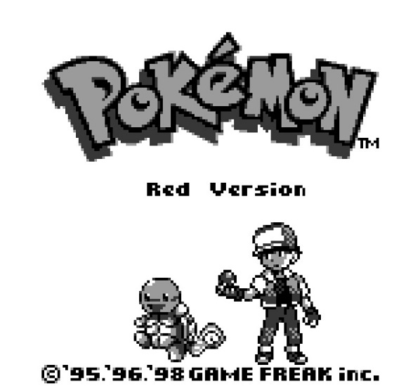
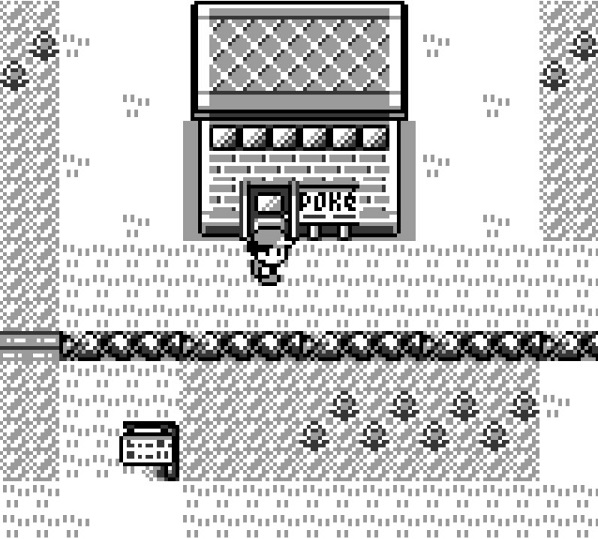
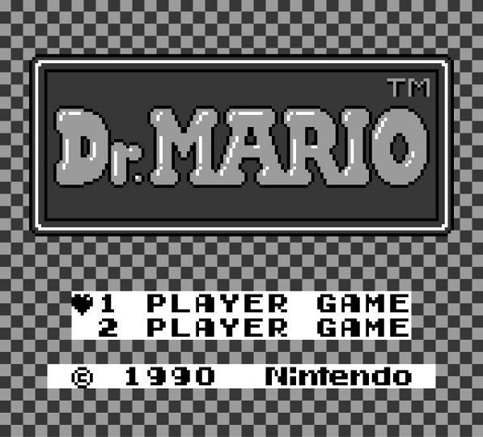
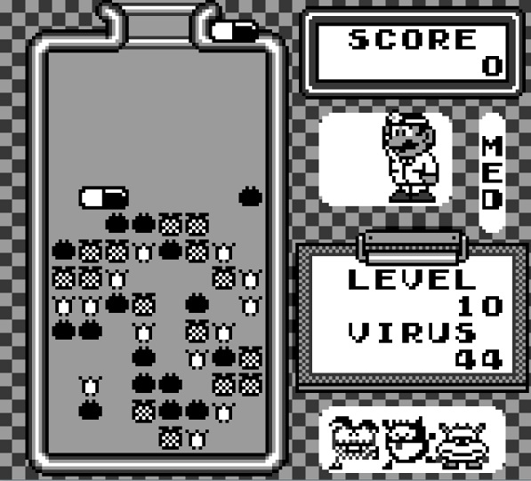
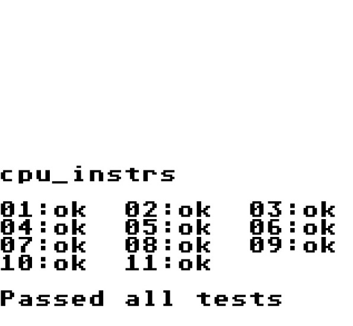

# GBLib
`GBLib` is a cross-platform Nintendo GameBoy emulator written as a portable C++ library. Easily inject your platform specific dependencies to run anywhere.

For an example on how to build an application on top of `GBLib` refer to [GBSdl](https://github.com/David-Parker/GBSdl).


## How do I use `GBLib` to make an application?
Almost all of the core emulation logic is contained inside the library itself. The only pieces you need to write are implementations to the interfaces defined in the `interface` directory. These implementations are for bridging your specific graphics and input handling frameworks with the emulator.

`IEventHandler.h`
```cpp
// Processes input events to send to the joypad controller.
class IEventHandler
{
public:
    // Polls for input events, and sets the appropriate button presses on the joypad controller.
    virtual void HandleInput(JoypadController* joypadController) = 0;

    // Should the emulator quit, writing any necessary save state to disk?
    virtual bool ShouldQuit() = 0;

    // Indicates what speed multiplier the emulator should actively run at.
    virtual int SpeedMultiplier() = 0;
};
```
`IGraphicsHandler.h`
```cpp
// Handles the graphics data sent from the PPU. Interface is injectable to GraphicsManager to allow
// for different rendering dependencies.
class IGraphicsHandler
{
public:
    // Initialize any dependenices. Called when LCD screen is powered on.
    virtual void Init() = 0;

    // Clear the screen (usually draw all white pixels to the screen).
    virtual void Clear() = 0;

    // Called from the ppu after all scanlines have been buffered, pixelBuffer is an array of pixels 
    // in little endian ARGB8888 format.
    virtual void Draw(const u32* pixelBuffer, int width, int height) = 0;

    // Quit and release any resources for the graphics handler.
    virtual void Quit() = 0;
};
```

These interfaces have been implemented using the Simple DirectMedia Layer (SDL) in [GBSdl](https://github.com/David-Parker/GBSdl).

## How to Build
In the root directory run CMake.

```
cmake .
```

CMake will generate platform specific build tools, e.g. a `Makefile` on Linux or a `Visual Studio Solution` in Windows.

All source files reside in the `src` directory and header files reside in the `include` directory.


## License
`GBLib` is released under the MIT license.

## Testing
To run unit tests, use the test project listed under the `test` folder. To run Blargg's GB Test Roms, load any of the roms under `rom\gb-test-roms` sub module.

## Media







