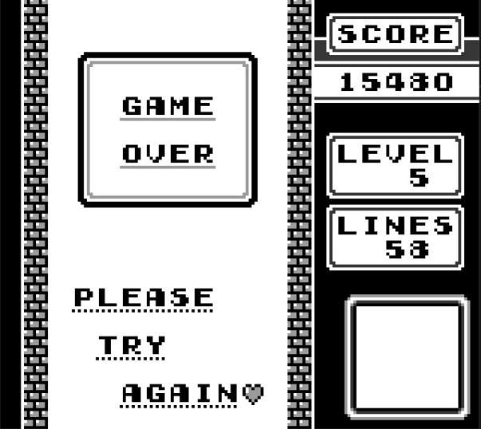

# GBLib
`GBLib` is GameBoy emulator written as a portable C++ library. Easily inject platform specific dependencies to run anywhere.

GameBoyApp project features an example using SDL for Windows.

## How to Build
All source and header files reside in the `src` folder. A Visual Studio solution and projects are provided.

## License
`GBLib` is released under the MIT license.

## Testing
To run unit tests, use the test project listed under the `test` folder. To run Blargg's GB Test Roms, load any of the roms under `rom\gb-test-roms` folder.

## Media

